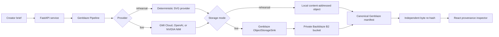

# Provenance Vault

**Generate media. Keep the proof.** Provenance Vault is a small production-shaped app for creators who need to prove where a campaign asset came from. A generation request runs through [Genblaze](https://github.com/backblaze-labs/genblaze), the output is written to Backblaze B2 under a content-addressed key, and the app can fetch the stored bytes again to verify their SHA-256 digest against the canonical provenance manifest.


This repository is an entry candidate for the [Backblaze Generative Media Hackathon](https://backblaze-generative-media.devpost.com/). It is deliberately honest about readiness: the local mode is fully exercised, while live B2 and AI-provider calls require the account credentials and terms listed in [submission/BLOCKERS.md](submission/BLOCKERS.md).

Public source: <https://github.com/gother111/backblaze-provenance-vault>

## Why it is useful

Creative teams routinely move generated media from a model into chat, downloads, shared drives, and publishing tools. That breaks the connection between the final file and the prompt, model, parameters, and generation time. Provenance Vault keeps that chain inspectable:

1. A creator enters a title, brief, format, palette, and provider.
2. Genblaze runs the provider step and constructs its canonical manifest.
3. In live mode, Genblaze's `ObjectStorageSink` writes the asset and manifest to Backblaze B2 with `KeyStrategy.CONTENT_ADDRESSABLE`.
4. The API reads the stored asset back and independently computes SHA-256.
5. The interface shows the provider/model, storage key, asset hash, manifest hash, and verification result.

The result is not a vague “AI generated” badge. It is a reproducible evidence trail tied to the exact stored bytes.

## Two explicit modes

| Mode | What runs | What it proves |
| --- | --- | --- |
| Local rehearsal | Real Genblaze `Pipeline`, deterministic local SVG provider, content-addressed local object, canonical manifest, byte re-hash | UI, orchestration, persistence, manifest validation, tamper detection. It does **not** claim AI generation or a B2 upload. |
| Live entry | Genblaze GMI Cloud, OpenAI, or NVIDIA NIM provider; Genblaze B2 object-storage sink; B2 read-back; manifest and byte verification | The actual competition integration after credentials and one successful end-to-end run are supplied. |

The UI labels local output `OFFLINE REHEARSAL` and shows `LOCAL DEMO` in the header. Live claims should only be used after completing the evidence gate in [submission/SUBMISSION_CHECKLIST.md](submission/SUBMISSION_CHECKLIST.md).

## Architecture



The important implementation detail is that `Manifest.verify()` and byte verification are separate checks. The former verifies the canonical manifest and declared digests. The app also downloads the actual stored object and hashes it again, so an altered or missing object fails visibly.

More detail is in [docs/ARCHITECTURE.md](docs/ARCHITECTURE.md).

## Local quick start

Requirements: Python 3.11–3.13, [uv](https://docs.astral.sh/uv/), Node.js, and npm.

```bash
cp .env.example .env
make install
```

In terminal 1:

```bash
set -a
source .env
set +a
make api
```

In terminal 2:

```bash
make web
```

Open `http://127.0.0.1:5173`. The API is at `http://127.0.0.1:8000`; its health endpoint is `/api/health`.

To run the built single-service app:

```bash
make build
.venv/bin/python -m uvicorn app.main:app --app-dir backend --host 127.0.0.1 --port 8000
```

## Configure the live competition path

Create a private B2 bucket and a bucket-scoped application key that can read and write files. Keep all values server-side:

```dotenv
PROVENANCE_STORAGE_MODE=b2
PROVENANCE_DEFAULT_PROVIDER=gmicloud

B2_KEY_ID=...
B2_APP_KEY=...
B2_BUCKET=...
B2_REGION=us-west-004

GMI_API_KEY=...
GMI_IMAGE_MODEL=seedream-5.0-lite
```

For Docker, the image already sets `PROVENANCE_DATA_DIR=/app/data` and the example volume keeps
that staging/local path persistent. For Vercel Services, leave `PROVENANCE_DATA_DIR` unset: B2 is
the durable run-index and manifest store, while any provider staging uses the runtime's temporary
directory and is not treated as durable state.

OpenAI is also supported through the official Genblaze connector:

```dotenv
OPENAI_API_KEY=...
OPENAI_IMAGE_MODEL=gpt-image-2
PROVENANCE_DEFAULT_PROVIDER=openai
```

The organizer's current multi-provider sample identifies NVIDIA NIM as a free,
no-card image-generation route based on its July 2026 research, while explicitly warning that
offers can change and must be confirmed in the provider console. This app prepares that route
through the official `genblaze-nvidia==0.3.3` image provider running inside the existing Genblaze
`Pipeline`:

```dotenv
NVIDIA_API_KEY=...
NVIDIA_IMAGE_MODEL=black-forest-labs/flux.1-schnell
PROVENANCE_DEFAULT_PROVIDER=nvidia
```

The resolved stack is `genblaze==0.4.5` with `genblaze-core==0.3.8` and
`genblaze-nvidia==0.3.3`. Those are the package versions published for the official Genblaze
`v0.7.0` release wave, and the connector's declared `genblaze-core>=0.3.7,<0.4` range is
satisfied. A network-free test exercises the installed connector's request and inline-image
response path. This is package/source alignment only: NVIDIA account access, current free-tier
availability, model availability, quota, response compatibility, and a real output remain
unconfirmed until one authorized live run succeeds.

Restart the API after changing environment variables. A live provider is intentionally rejected unless B2 is also configured. This prevents a successful live generation from bypassing the competition's storage requirement.

Run one new asset, press **Verify bytes**, then confirm all of the following before recording the demo:

- the header says `B2 CONNECTED`;
- the selected provider is GMI Cloud, OpenAI, or NVIDIA NIM;
- the run's storage mode is `b2`;
- the storage key is content-addressed and contains the asset SHA-256;
- manifest verification and byte verification both pass;
- the object and manifest exist in the intended B2 bucket.

## API surface

| Method | Path | Purpose |
| --- | --- | --- |
| `GET` | `/api/health` | Service, Genblaze version, capability booleans, run count |
| `GET` | `/api/config` | Non-secret readiness state for the UI |
| `GET` | `/api/runs` | Immutable local or B2-backed run index |
| `POST` | `/api/runs` | Generate, seal, persist, and verify one asset |
| `GET` | `/api/runs/{id}/asset` | Stream the local or B2 object through the API |
| `GET` | `/api/runs/{id}/manifest` | Return the canonical Genblaze manifest |
| `POST` | `/api/runs/{id}/verify` | Re-read bytes and compare SHA-256 |

Interactive API documentation is available at `/docs` while the service is running.

## Verification

```bash
make verify
```

This runs Python linting, backend tests, TypeScript checking, frontend tests, and the production frontend build. The backend suite covers actual local Genblaze orchestration, canonical manifests, content-addressed keys, a directory containing spaces, API behavior, secret redaction, OpenAI size contracts, network-free NVIDIA response parsing, byte-tampering detection, B2 repository behavior through network-free fakes, the Vercel route-prefix boundary, and parity between root and service-specific runtime-provider dependencies.

## Deployment

The repository supports two deployment shapes without changing the public `/api/*` contract:

- [Dockerfile](Dockerfile) builds the React client and FastAPI API as one service. Its explicit
  `/app/data` path remains compatible with a persistent volume.
- [vercel.json](vercel.json) defines separate Vite and FastAPI Vercel Services. When B2 mode and
  credentials are configured, the full run record and canonical manifest copy are persisted in
  B2, so the searchable library does not depend on a serverless filesystem.

The Vercel project must use the **Services** Framework Preset. The configuration and network-free
tests are present, but no Vercel project, deployment, environment values, or live B2/provider run
has been created from this repository.

Example:

```bash
docker build -t provenance-vault .
docker run --rm -p 8000:8000 --env-file .env -v provenance-data:/app/data provenance-vault
```

Do not bake `.env` into the image or expose provider/B2 credentials to the browser. See [docs/DEPLOYMENT.md](docs/DEPLOYMENT.md) for the public-deployment acceptance checks.

## Repository map

- `backend/app/`: FastAPI API, Genblaze pipeline, B2 sink, repository, and verifier
- `backend/vercel_app.py`: prefix-free internal FastAPI entrypoint for the `/api` Vercel Service
- `frontend/src/`: React interface and provenance inspector
- `vercel.json`: Vite `/` plus FastAPI `/api` Services routing
- `tests/`: backend integration and API tests
- `docs/`: architecture, rules research, design system, deployment, and QA evidence
- `submission/`: concise and extended Devpost copy, live-evidence packet, demo script, readiness checklist, blockers, and Genblaze feedback draft

## Current evidence status

| Claim | Status on 2026-08-02 |
| --- | --- |
| App works locally | Confirmed |
| Real Genblaze pipeline and manifest run locally | Confirmed |
| Content-addressed storage and byte tamper detection | Confirmed locally |
| Responsive desktop/mobile UI | Current local NVIDIA-selector build confirmed in Chrome at 1440 × 1000, 390 × 844, and 320 × 740 after fixing an exact-320 px horizontal-overflow defect; physical-device and final public-deployment QA remain pending |
| B2 integration and B2-backed run-index code exists | Confirmed by inspection/fake tests that do not call B2 |
| Vercel Services source configuration | Confirmed locally; **not deployed** |
| Successful real B2 upload/read-back | **Not yet confirmed: credentials required** |
| Successful real AI-provider generation | **Not yet confirmed: provider account/key required; NVIDIA is the prepared candidate route, with current offer/model access unverified** |
| Public GitHub repository | Confirmed; verify that `origin/main` matches the exact final source receipt before deployment or submission |
| Local rehearsal judge video | Confirmed locally at 2:44; truth-labeled, validated, and not uploaded; see [`submission/LOCAL_REHEARSAL_VIDEO.md`](submission/LOCAL_REHEARSAL_VIDEO.md) |
| Public app, public demo video, Devpost submission | **Not yet created** |

Do not collapse these states. A compliant final entry needs the last three rows completed before the deadline.

## Official references

- [Hackathon overview and submission requirements](https://backblaze-generative-media.devpost.com/)
- [Official rules](https://backblaze-generative-media.devpost.com/rules)
- [Hackathon resources](https://backblaze-generative-media.devpost.com/resources)
- [Hackathon updates](https://backblaze-generative-media.devpost.com/updates)
- [Genblaze repository](https://github.com/backblaze-labs/genblaze)
- [Official Backblaze multi-provider sample and candidate NVIDIA route](https://github.com/backblaze-labs/genblaze-gen-media-multi-provider-sample)
- [Backblaze B2 APIs](https://www.backblaze.com/docs/cloud-storage-apis)
- [Backblaze S3-compatible API](https://www.backblaze.com/docs/cloud-storage-call-the-s3-compatible-api)

## License

[MIT](LICENSE). The entrant must still verify rights for every prompt, generated output, logo, font, sample asset, voice, and music used in the final public demo.
